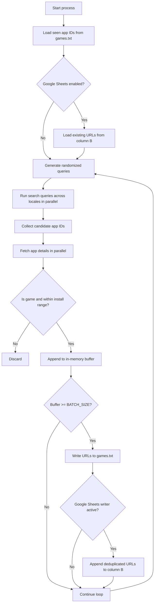

# App-Finder

A high-throughput Python game discovery utility that continuously scrapes Google Play search results, filters by install-range heuristics, and persists deduplicated URLs to local storage and Google Sheets.

[](https://www.python.org/)
[](LICENSE)
[](#testing)
[](#testing)

> [!NOTE]
> The original project name is `App-Finder`, but operationally this repository behaves like a lightweight data collection pipeline for Google Play game URLs.

## Table of Contents

- [Features](#features)
- [Tech Stack & Architecture](#tech-stack--architecture)
- [Getting Started](#getting-started)
- [Testing](#testing)
- [Deployment](#deployment)
- [Usage](#usage)
- [Configuration](#configuration)
- [License](#license)
- [Support the Project](#support-the-project)

## Features

- Continuous discovery loop with randomized query generation to increase search-space coverage.
- Concurrent Google Play search and details-fetch stages powered by `ThreadPoolExecutor`.
- Install-count gatekeeping via configurable `MIN_INSTALLS` / `MAX_INSTALLS` thresholds.
- Genre filtering to keep only game-related listings (`genre` or `genreId` validation).
- Batch-oriented persistence pipeline for lower I/O overhead.
- Deduplication across sessions by loading previously collected app IDs from output artifacts.
- Dual-sink output model:
  - Local text sink (`games.txt` by default).
  - Optional Google Sheets sink (column `B`, append-only semantics, dedupe aware).
- Locale diversification support via configurable `(language, country)` pairs.
- Graceful shutdown behavior (`Ctrl+C`) that flushes buffered links before exiting.

> [!TIP]
> Increasing `QUERIES_PER_RUN`, `SEARCH_LIMIT`, and `WORKERS` improves throughput, but may increase request failures and API throttling risk.

## Tech Stack & Architecture

### Core Stack

- **Language:** Python 3
- **Primary scraper dependency:** `google-play-scraper`
- **Sheets integration:** `gspread`, `google-auth`
- **Concurrency model:** Native thread pool (`concurrent.futures.ThreadPoolExecutor`)
- **Configuration style:** Static Python module (`settings.py`)

### Project Structure

```text
.
├── LICENSE
├── README.md
├── main.py                # Scraping loop, filtering, batching, and orchestration
├── settings.py            # Runtime and output configuration
├── sheet.py               # Google Sheets adapter and dedupe-aware appender
├── requirements.txt       # Python dependencies
├── games.txt              # Local output file (generated/updated at runtime)
└── service_account.json   # Google service account credentials (user-provided)
```

### Key Design Decisions

- **Infinite worker loop:** optimized for long-running collection sessions over one-shot extraction.
- **Two-phase retrieval:** first collect candidate app IDs from search, then hydrate metadata per app ID for accurate filtering.
- **Buffered writes:** accumulate `BATCH_SIZE` app IDs before persistence to reduce file and network write churn.
- **Deduplication-first mindset:** previously seen IDs are loaded from local output and Google Sheets before each run.
- **Fail-soft network strategy:** API exceptions are swallowed per task to keep the pipeline progressing.

> [!IMPORTANT]
> This utility intentionally trades strict observability for resilience: recoverable API errors are ignored in worker tasks to avoid stopping collection.

### Pipeline Diagram



## Getting Started

### Prerequisites

- Python `3.10+` (recommended: latest stable Python 3.x)
- Internet connectivity for Google Play scraping endpoints
- (Optional) Google Cloud service account JSON with Sheets API access
- (Optional) A Google Sheet shared with the service account email

### Installation

```bash
git clone https://github.com/OstinUA/random-google-play-game-scraper.git
cd random-google-play-game-scraper
python -m venv .venv
source .venv/bin/activate  # On Windows: .venv\Scripts\activate
pip install --upgrade pip
pip install -r requirements.txt
```

> [!WARNING]
> Do not commit `service_account.json` with real credentials into public repositories.

## Testing

This repository currently does not ship a formal unit/integration test suite. Use the following baseline checks:

```bash
python -m compileall main.py settings.py sheet.py
python main.py
```

Recommended local quality gates (if you add tooling):

```bash
pip install ruff pytest
ruff check .
pytest
```

> [!NOTE]
> `python main.py` is both a runtime smoke test and the primary operational entrypoint.

## Deployment

### Production Execution Guidance

- Run the process in a supervised environment (`systemd`, Docker, or process manager).
- Mount a persistent volume for `games.txt` to preserve deduplication state.
- Provide `service_account.json` as a mounted secret where possible.
- Tune concurrency (`WORKERS`) based on outbound network limits and host CPU capacity.

### Example systemd Unit

```ini
[Unit]
Description=App-Finder Google Play Game Scraper
After=network.target

[Service]
Type=simple
WorkingDirectory=/opt/random-google-play-game-scraper
ExecStart=/opt/random-google-play-game-scraper/.venv/bin/python main.py
Restart=always
RestartSec=5

[Install]
WantedBy=multi-user.target
```

### Containerization Notes

A minimal container strategy:

1. Build from a slim Python base image.
2. Install `requirements.txt`.
3. Copy project files.
4. Set command to `python main.py`.
5. Mount credentials and output volume at runtime.

> [!CAUTION]
> High worker counts can trigger transient request failures or remote throttling; scale conservatively in production.

## Usage

### Basic Run

```bash
python main.py
```

### Programmatic Example

```python
from pathlib import Path

import settings
from main import collect_candidates, iter_games, load_existing, append_links, PLAY_URL

output = Path(settings.OUTPUT_FILE)
seen = load_existing(output)  # Load existing app IDs from saved links

# Discover candidate app IDs using randomized queries and locale fan-out
candidates = collect_candidates(seen)

# Filter candidates by game category + install bounds, then persist
selected_ids = [app_id for app_id in iter_games(candidates) if app_id not in seen]
append_links(output, selected_ids)

print(f"Saved {len(selected_ids)} URLs")
print("Example:", PLAY_URL.format(app_id=selected_ids[0]) if selected_ids else "no matches")
```

### Graceful Shutdown

- Press `Ctrl+C` to stop.
- The process catches `KeyboardInterrupt` and flushes the buffered URLs before exiting.

## Configuration

Configuration is centralized in `settings.py`.

### Core Filters

- `MIN_INSTALLS`: lower install threshold (inclusive).
- `MAX_INSTALLS`: upper install threshold (inclusive). Set to `0` to disable the cap.

### Output and Batching

- `OUTPUT_FILE`: path to local URL output file.
- `BATCH_SIZE`: number of app IDs buffered before a write flush.

### Search Throughput

- `QUERIES_PER_RUN`: randomized query count per cycle.
- `SEARCH_LIMIT`: max results requested per search query.
- `WORKERS`: parallel worker count for search/details phases.
- `SEARCH_LOCALES`: list of `(lang, country)` tuples for international query coverage.

### Google Sheets Integration

- `GOOGLE_SHEET_ENABLED`: master flag for Sheets sync.
- `GOOGLE_SHEET_URL`: sheet URL or raw spreadsheet ID.
- `GOOGLE_SHEET_TAB`: worksheet index (0-based).
- `SERVICE_ACCOUNT_FILE`: path to service account JSON key file.

### Example `settings.py`

```python
MIN_INSTALLS = 10_000
MAX_INSTALLS = 100_000
OUTPUT_FILE = "games.txt"
BATCH_SIZE = 10
QUERIES_PER_RUN = 20
SEARCH_LIMIT = 60
WORKERS = 20

GOOGLE_SHEET_ENABLED = True
GOOGLE_SHEET_URL = "https://docs.google.com/spreadsheets/d/<SPREADSHEET_ID>/edit"
GOOGLE_SHEET_TAB = 0
SERVICE_ACCOUNT_FILE = "service_account.json"

SEARCH_LOCALES = [
    ("en", "us"),
    ("en", "gb"),
    ("de", "de"),
]
```

## License

This project is distributed under the **MIT License**. See [`LICENSE`](LICENSE) for full legal terms.

## Support the Project

[](https://www.patreon.com/OstinFCT)
[](https://ko-fi.com/fctostin)
[](https://boosty.to/ostinfct)
[](https://www.youtube.com/@FCT-Ostin)
[](https://t.me/FCTostin)

If you find this tool useful, consider leaving a star on GitHub or supporting the author directly.
